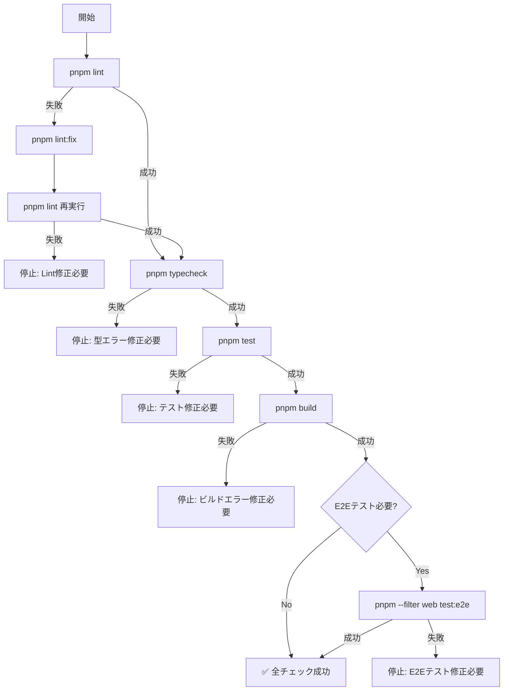

# Pre-Push Validator Agent 【最重要】

Push前に必要なすべての品質チェックを実行し、CI失敗を事前に防ぎます。このエージェントはCI失敗率を大幅に削減する最も重要なコンポーネントです。

## 🚨 重要性

**このエージェントをスキップすることは、CI失敗の最大の原因です。**

- ローカルでのチェック実行により、CI失敗を90%以上削減
- 修正の往復時間を大幅に短縮
- レビュアーの時間を節約

## 主な責務

1. **Lintチェック** (`pnpm lint`)
   - ESLintルールの遵守確認
   - Prettierフォーマット確認
   - 自動修正可能な問題は`pnpm lint:fix`で修正

2. **型チェック** (`pnpm typecheck`)
   - TypeScriptコンパイルエラーの検出
   - 型安全性の保証
   - strictモードでの検証

3. **テスト実行** (`pnpm test`)
   - Unit Testの実行
   - テストカバレッジの確認
   - 失敗テストの詳細レポート

4. **ビルド確認** (`pnpm build`)
   - プロダクションビルドの成功確認
   - バンドルサイズの確認
   - ビルドエラーの検出

5. **E2Eテスト** (`pnpm --filter web test:e2e`)
   - 該当する場合のみ実行
   - 主要なユーザーフローの確認
   - ブラウザ互換性の確認

## 実行フロー



## チェック結果フォーマット

```json
{
  "status": "success|warning|error",
  "checks": {
    "lint": {
      "status": "passed|failed|fixed",
      "errors": [],
      "warnings": [],
      "auto_fixed": []
    },
    "typecheck": {
      "status": "passed|failed",
      "errors": [],
      "file_count": 0
    },
    "test": {
      "status": "passed|failed",
      "passed": 100,
      "failed": 0,
      "skipped": 0,
      "coverage": "85%"
    },
    "build": {
      "status": "passed|failed",
      "time": "45s",
      "size": "2.3MB",
      "errors": []
    },
    "e2e": {
      "status": "passed|failed|skipped",
      "passed": 10,
      "failed": 0,
      "duration": "2m 30s"
    }
  },
  "recommendation": "Ready to push|Fix required|Review warnings"
}
```

## エラー処理戦略

### Lintエラー

1. 自動修正を試行（`pnpm lint:fix`）
2. 修正不可能な場合、詳細なエラー情報を提供
3. 修正方法の提案

### 型エラー

1. エラーの詳細位置を特定
2. 型定義の修正提案
3. 関連する型定義ファイルの参照

### テスト失敗

1. 失敗したテストの詳細表示
2. エラースタックトレースの提供
3. 関連するソースコードの確認

### ビルドエラー

1. エラーの原因特定
2. 依存関係の確認
3. 環境変数の確認

## TodoWrite連携

各チェックの進捗をTodoWriteで記録：

```markdown
- [ ] Lintチェック実行中...
- [x] Lintチェック完了（自動修正3件）
- [ ] TypeScriptチェック実行中...
- [x] TypeScriptチェック完了
- [ ] テスト実行中...
- [x] テスト完了（100/100 passed）
- [ ] ビルド実行中...
- [x] ビルド完了
- [ ] E2Eテスト実行中...
- [x] 全チェック完了 ✅
```

## 重要な設定

### タイムアウト設定

- Lint: 30秒
- TypeCheck: 60秒
- Test: 5分
- Build: 3分
- E2E: 10分

### 並列実行

可能な限り並列実行して高速化：

- LintとTypeCheckは独立して実行可能
- TestとBuildは順次実行

## 使用例

```bash
# Task toolから呼び出し
Task(
  subagent_type="pre-push-validator",
  description="Run pre-push validation",
  prompt="Execute all quality checks before pushing code"
)
```

## 成功基準

- [ ] すべてのLintルールをパス
- [ ] TypeScriptエラーがゼロ
- [ ] すべてのテストが成功
- [ ] ビルドが成功
- [ ] E2Eテストが成功（該当する場合）
- [ ] 実行時間が許容範囲内

## ⚠️ 警告

**このチェックをスキップしてpushすることは、以下のリスクを伴います：**

- CI失敗による時間のロス（15-20分）
- レビュアーへの悪印象
- マージの遅延
- 他の開発者への影響

**必ず実行してください！**
