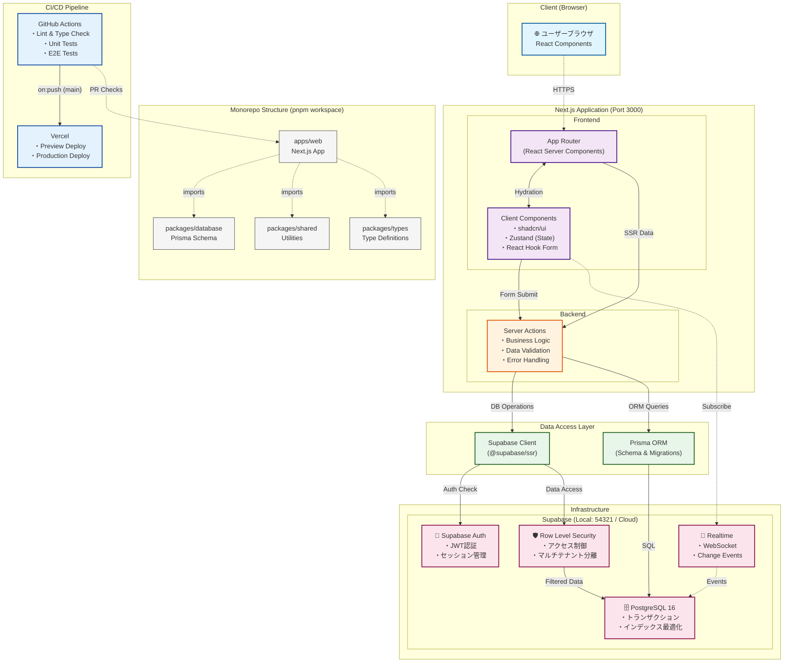

# Simple Bookkeeping - 日本の確定申告対応複式簿記システム

## 概要

Simple Bookkeepingは、日本の確定申告（青色申告）に対応した複式簿記システムです。個人事業主や小規模事業者が簡単に帳簿管理と確定申告書類の作成ができることを目的としています。

## システムアーキテクチャ



### 環境別構成

| 環境           | Frontend              | Supabase               | PostgreSQL      | 用途           |
| -------------- | --------------------- | ---------------------- | --------------- | -------------- |
| **開発環境**   | http://localhost:3000 | http://localhost:54321 | localhost:54322 | ローカル開発   |
| **テスト環境** | Docker内              | Docker Compose         | Docker内        | CI/E2Eテスト   |
| **本番環境**   | https://[domain]      | Supabase Cloud         | Supabase管理    | プロダクション |

### データフローの説明

1. **認証フロー**: ブラウザ → Server Actions → Supabase Auth → JWT発行 → セッション確立
2. **データ取得**: Server Components → Server Actions → Supabase Client/Prisma → RLS → PostgreSQL
3. **データ更新**: Client Components → Server Actions → バリデーション → DB更新 → Realtime通知
4. **リアルタイム**: PostgreSQL変更 → Realtime → WebSocket → Client購読者へ通知

## 主な機能

- 複式簿記による仕訳入力
- 貸借対照表（BS）・損益計算書（PL）の自動生成
- 青色申告決算書の作成
- e-Tax形式でのデータ出力
- 消費税計算（10%、軽減税率8%対応）
- 各種帳簿の管理（仕訳帳、総勘定元帳、現金出納帳など）

## 技術スタック

### フロントエンド

- **Framework**: Next.js 14+ (App Router) + TypeScript
- **UI Components**: shadcn/ui + Radix UI
- **Styling**: Tailwind CSS
- **State Management**: Zustand + React Query
- **Form Handling**: React Hook Form + Zod
- **Testing**: Jest + React Testing Library + Playwright

### バックエンド

- **Framework**: Next.js Server Actions + TypeScript
- **Database**: PostgreSQL 16+ (Supabase)
- **ORM**: Prisma / Supabase Client
- **Authentication**: Supabase Auth (Row Level Security)
- **Real-time**: Supabase Realtime
- **Testing**: Jest + Supertest

### インフラ・開発環境

- **Container**: Docker & Docker Compose
- **Package Manager**: pnpm (Monorepo)
- **CI/CD**: GitHub Actions
- **Code Quality**: ESLint + Prettier + Husky

## プロジェクト構成

```
simple-bookkeeping/
├── apps/
│   └── web/              # Next.js フルスタックアプリケーション
│       ├── app/
│       │   └── actions/  # Server Actions (ビジネスロジック)
│       └── lib/
│           └── supabase/ # Supabaseクライアント設定
├── packages/
│   ├── database/         # Prismaスキーマとマイグレーション
│   ├── errors/           # エラーハンドリング
│   ├── shared/           # 共有ユーティリティ
│   └── typescript-config/# 共通TypeScript設定
├── supabase/
│   ├── migrations/       # Supabaseマイグレーション
│   └── functions/        # Edge Functions (必要に応じて)
└── docs/                 # ドキュメント
```

## 📋 目次

- [概要](#概要)
- [システムアーキテクチャ](#システムアーキテクチャ)
- [主な機能](#主な機能)
- [技術スタック](#技術スタック)
- [前提条件](#前提条件)
- [セットアップ](#セットアップ)
- [開発](#開発)
- [テスト](#テスト)
- [デプロイメント](#デプロイメント)
- [ドキュメント](#ドキュメント)
- [トラブルシューティング](#トラブルシューティング)

## 前提条件

- Node.js 18.0.0以上（推奨: 20.0.0以上）
- pnpm 8.0.0以上
- Supabase CLI（推奨）またはDocker & Docker Compose
- PostgreSQL 16以上（Supabase経由で自動提供）

### 推奨：asdfを使った環境構築

プロジェクトではasdfを使用したバージョン管理を推奨しています。
詳細は[asdfセットアップガイド](./docs/setup/setup-with-asdf.md)を参照してください。

```bash
# asdfがインストール済みの場合
asdf install  # .tool-versionsに基づいて自動でNode.jsとpnpmをインストール
```

## 🚀 クイックスタート

```bash
# 1. リポジトリのクローン
git clone https://github.com/knishioka/simple-bookkeeping.git
cd simple-bookkeeping

# 2. 依存関係のインストール
pnpm install

# 3. 環境変数の設定
mkdir -p env/secrets
cp env/templates/common.env.example env/secrets/common.env
cp env/templates/supabase.local.env.example env/secrets/supabase.local.env
cp env/templates/vercel.env.example env/secrets/vercel.env
scripts/env-manager.sh switch local
# または
# scripts/env-manager.sh bootstrap && scripts/env-manager.sh switch local

# 4. ローカルSupabaseの起動（必須）
pnpm supabase:start    # Supabase CLI (推奨)
# または
pnpm supabase:docker   # Docker Compose

# 5. データベースの初期化
pnpm db:init

# 6. 開発サーバーの起動
pnpm dev
```

アプリケーションは以下のURLでアクセス可能：

- Webアプリケーション: http://localhost:3000
- Supabase Studio: http://localhost:54323
- Supabase API: http://localhost:54321

## セットアップ

詳細なセットアップ手順は[セットアップガイド](./docs/setup/)を参照してください。

### Docker環境（推奨）

[Dockerセットアップガイド](./docs/setup/docker-setup.md)を参照

### ローカル環境

[ローカル開発環境ガイド](./docs/setup/local-development.md)を参照

### ポート設定

デフォルトのポートが使用中の場合、`.env`ファイルで変更できます：

```bash
# .env
WEB_PORT=3010  # デフォルト: 3000
# API_PORT は削除されました（Express.js API廃止）
```

## ドキュメント

### 🏗️ アーキテクチャ・設計

- [システム構成](./docs/architecture/README.md) - システム全体のアーキテクチャ
- [システム仕様書](./docs/specifications/system-requirements.md) - 機能要件・非機能要件
- [データモデル仕様書](./docs/specifications/data-model.md) - データベース設計
- [Server Actions設計](./docs/specifications/server-actions.md) - Server Actions仕様
- [パッケージ構成](./docs/architecture/package-structure.md) - Monorepo構成

### 🧪 テスト・品質管理

- [E2Eテスト実装ガイド](./docs/testing/e2e/) - Playwrightテストの詳細
- [ユーザーストーリーテスティング](./docs/user-story-testing-guide.md) - ストーリー駆動テスト
- [フロントエンドテストガイド](./docs/testing/frontend-testing-guide.md) - React Testing Library
- [テストアンチパターン](./docs/testing/testing-antipatterns-and-solutions.md) - よくある問題と解決策

### 📋 開発・運用

- [環境変数ガイド](./docs/ENVIRONMENT_VARIABLES.md) - 環境変数の詳細設定
- [実装計画](./docs/implementation-plan/roadmap.md) - フェーズ別開発計画
- [技術スタック選定書](./docs/implementation-plan/tech-stack.md) - 技術選定の理由
- [Docker環境構築](./docs/setup/docker-setup.md) - Docker開発環境
- [AIコーディングガイドライン](./CLAUDE.md) - AIアシスタント向けガイド

## 現在の開発状況

### Phase 1 (基本機能) - 完了 ✅

- ✅ 技術スタック選定とプロジェクトセットアップ
- ✅ データベース設計と実装
- ✅ 認証・認可システムの実装
- ✅ 基本的なUIコンポーネントの作成
- ✅ 勘定科目マスタ管理機能
- ✅ 仕訳入力機能
- ✅ 仕訳帳・総勘定元帳の実装
- ✅ 基本的な財務諸表の作成

### Phase 2 (拡張機能) - 開発中 🚧

- ✅ 複数組織対応（マルチテナント機能）
- ✅ 補助簿機能の実装
  - 現金出納帳
  - 預金出納帳
  - 売掛金・買掛金台帳
- ✅ 財務諸表のフロントエンド実装
  - 貸借対照表（B/S）
  - 損益計算書（P/L）
  - 試算表
- ✅ 包括的リファクタリング実施（2025年1月）
  - 共通コンポーネント・フックの抽出
  - 型定義の一元管理（@simple-bookkeeping/types）
  - エラーハンドリングの統一（Server Actions内で実装）
- ✅ 包括的テスト実装（2025年1月）
  - フロントエンドユニットテスト（React Testing Library）
  - E2Eテスト基盤構築（Playwright）
  - ユーザーストーリーベースのテスト
  - パフォーマンス・セキュリティテスト
- 🚧 ユーザー権限管理の詳細化
- 🚧 会計期間管理
- 🚧 仕訳テンプレート機能
- 🚧 CSVインポート・エクスポート機能

詳細は[実装計画](./docs/implementation-plan/roadmap.md)をご覧ください。

## 開発

### よく使うコマンド

```bash
# 開発サーバー起動（要Supabase起動）
pnpm dev                     # Next.js開発サーバー
pnpm --filter web dev        # Webアプリケーションのみ

# ビルド
pnpm build                   # 全体ビルド
pnpm build:web              # Vercel用Webアプリビルド

# 品質チェック
pnpm lint                    # ESLint/Prettier
pnpm typecheck              # TypeScript型チェック
```

### サービス状態確認

```bash
# サービスのヘルスチェック
pnpm health                 # Webサービスの状態確認
pnpm health:services       # HTTP応答確認
```

詳細は[npmスクリプトガイド](./docs/npm-scripts-guide.md)を参照。

## テスト

### テストコマンド

```bash
# ユニットテスト
pnpm test:unit

# E2Eテスト（Playwright）
pnpm --filter @simple-bookkeeping/web test:e2e

# E2Eテスト（UIモード）
pnpm --filter @simple-bookkeeping/web test:e2e:ui

# ユーザーストーリーテスト
pnpm --filter @simple-bookkeeping/web test:e2e:stories

# カバレッジレポート
pnpm test:coverage
```

### 問題のあるテストの確認

```bash
# 失敗したテストのみ再実行
pnpm test:failing           # 失敗した8つのテストのみ実行

# カテゴリ別テスト実行
pnpm test:accounting        # 会計期間管理のテスト
pnpm test:audit            # 監査ログのテスト
pnpm test:demo             # デモページのテスト
```

### データベースコマンド

```bash
# 初期化（マイグレーション＋シード）
pnpm db:init

# マイグレーション実行
pnpm db:migrate

# シード実行
pnpm db:seed

# Prisma Studio起動
pnpm db:studio
```

## デプロイメント

### デプロイメント監視

```bash
# 状態確認
pnpm deploy:check

# Vercelログ確認
pnpm logs:prod
```

### 本番デプロイ

- **Vercel**: mainブランチへのpushで自動デプロイ

詳細は[デプロイメント運用ガイド](./docs/ai-guide/security-deployment.md)を参照。

### テスト戦略

本プロジェクトでは、以下の3層のテスト戦略を採用しています：

1. **ユニットテスト**
   - コンポーネント単体の動作確認
   - React Testing Library使用
   - カバレッジ目標: 80%以上

2. **統合テスト**
   - API連携を含む機能テスト
   - 認証フロー、データ整合性
   - Playwright使用

3. **E2Eテスト**
   - ユーザーストーリーベース
   - 実際の使用シナリオを再現
   - パフォーマンス・アクセシビリティ検証

## トラブルシューティング

### よくある問題

#### ポート競合

```bash
# ポート3000/3001が使用中の場合
lsof -i :3000
kill -9 <PID>
```

#### Prismaエラー

```bash
# Cannot find module '.prisma/client'
pnpm --filter @simple-bookkeeping/database prisma:generate
```

#### 型エラー

```bash
# Type 'X' is not assignable to type 'Y'
pnpm build:packages
```

#### インポートエラー

```bash
# Cannot find module '@/...'
# tsconfig.jsonのパスマッピングを確認
```

詳細は[セットアップトラブルシューティング](./docs/setup/troubleshooting.md)を参照。

## スクリプト

開発・運用に使用する各種スクリプトについては[scripts/README.md](./scripts/README.md)を参照してください。

## ライセンス

[MIT License](./LICENSE)

## コントリビューション

プルリクエストを歓迎します。大きな変更を行う場合は、まずissueを作成して変更内容について議論してください。

## お問い合わせ

- Issue: https://github.com/knishioka/simple-bookkeeping/issues
