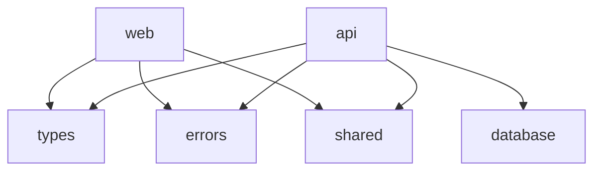

# パッケージ構成

## 概要

本プロジェクトはMonorepo構成を採用し、複数のパッケージで構成されています。

## パッケージ一覧

### アプリケーション

#### @simple-bookkeeping/web

- **役割**: フルスタックアプリケーション
- **技術**: Next.js 14, React 18, TypeScript, Server Actions
- **主要機能**:
  - ユーザーインターフェース
  - Server Actionsによるビジネスロジック
  - Supabase Authによる認証
  - 勘定科目管理
  - 仕訳入力
  - 財務諸表表示

#### @simple-bookkeeping/api （削除済み）

- **状態**: 完全削除済み
- **移行先**: Server Actions (apps/web/app/actions/)
- **理由**: Supabase + Server Actionsアーキテクチャへの統一

### 共有パッケージ

#### @simple-bookkeeping/database

- **役割**: データベーススキーマとマイグレーション
- **内容**:
  - Prismaスキーマ定義
  - マイグレーションファイル
  - シードデータ

#### @simple-bookkeeping/types

- **役割**: 共通型定義
- **内容**:

  ```typescript
  // 認証関連
  export interface User { ... }
  export interface AuthTokens { ... }

  // ビジネスエンティティ
  export interface Account { ... }
  export interface JournalEntry { ... }
  export interface Organization { ... }

  // API関連
  export interface ApiResponse<T> { ... }
  export interface PaginatedResponse<T> { ... }
  ```

#### @simple-bookkeeping/shared

- **役割**: 共有ユーティリティ
- **内容**:
  - 定数定義
  - ヘルパー関数
  - 共通設定

#### @simple-bookkeeping/typescript-config

- **役割**: TypeScript設定の共有
- **内容**:
  - tsconfig.base.json
  - 共通コンパイラ設定

## パッケージ間の依存関係



## パッケージ管理

### pnpm workspace

```yaml
packages:
  - apps/*
  - packages/*
```

### インストール

```bash
# ルートですべての依存関係をインストール
pnpm install

# 特定パッケージに依存関係を追加
pnpm --filter @simple-bookkeeping/web add react-hook-form
```

### ビルド

```bash
# すべてのパッケージをビルド
pnpm build

# 特定パッケージをビルド
pnpm --filter @simple-bookkeeping/types build
```

### 開発

```bash
# 開発サーバー起動
pnpm dev

# 特定パッケージの開発
pnpm --filter @simple-bookkeeping/web dev
```

## ベストプラクティス

### 1. 型定義の一元管理

すべての共通型定義は`@simple-bookkeeping/types`に配置し、他のパッケージから参照する。

### 2. エラーハンドリング

エラーハンドリングはServer Actions内で実装し、適切なエラーメッセージを返す。

### 3. 循環参照の回避

パッケージ間の依存関係は単方向になるよう設計。

### 4. バージョニング

各パッケージは独立したバージョンを持つが、メジャーバージョンは統一。

## 今後の拡張

### 計画中のパッケージ

- **@simple-bookkeeping/ui**: 共通UIコンポーネントライブラリ
- **@simple-bookkeeping/validators**: 共通バリデーションルール
- **@simple-bookkeeping/i18n**: 国際化対応
