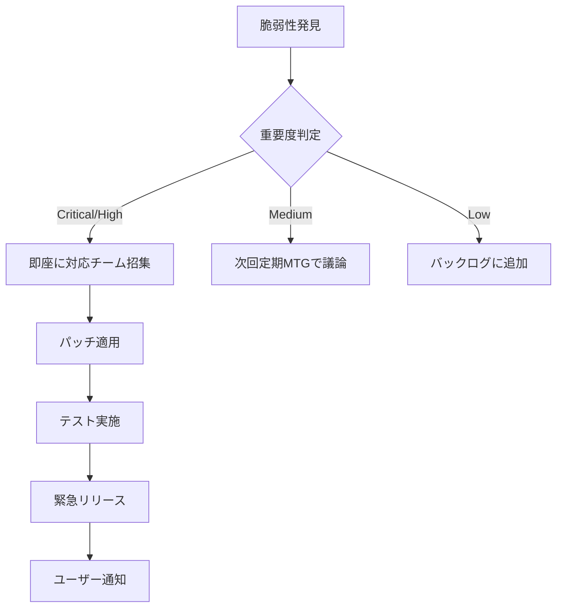

# Security Policy

## 📋 概要

このドキュメントは、Simple Bookkeepingプロジェクトのセキュリティポリシーと依存関係管理戦略を定義します。

## 🎯 セキュリティ目標

- **脆弱性ゼロの維持**: 高・重大レベルの脆弱性を24時間以内に対応
- **依存関係の最新化**: セキュリティパッチを1週間以内に適用
- **予防的対策**: 定期的な監査と自動化による早期発見

## 📦 サポートバージョン

| Version | Supported | Notes        |
| ------- | --------- | ------------ |
| main    | ✅        | 本番環境     |
| develop | ✅        | 開発環境     |
| < 30d   | ⚠️        | 限定サポート |
| > 30d   | ❌        | サポート終了 |

## ⏱️ 対応時間目標

| 脆弱性レベル | 対応時間目標 | 対応内容                         |
| ------------ | ------------ | -------------------------------- |
| Critical     | 24時間以内   | 即座にパッチ適用、緊急リリース   |
| High         | 3日以内      | パッチ適用、次回リリースに含める |
| Medium       | 1週間以内    | 定期アップデートで対応           |
| Low          | 次回定期更新 | 月次アップデートで対応           |

## 🔄 アップデート戦略

### 自動アップデート（Dependabot）

#### パッチアップデート（x.x.X）

- **自動マージ**: CI通過後、自動的にマージ
- **頻度**: 随時
- **グループ化**: 週次でまとめてPR作成

#### マイナーアップデート（x.X.x）

- **自動承認**: CIチェック後、手動マージ
- **頻度**: 週次
- **レビュー**: 破壊的変更の確認

#### メジャーアップデート（X.x.x）

- **手動対応**: 四半期ごとに計画的に実施
- **プロセス**:
  1. 影響調査とテスト計画作成
  2. 開発環境での検証
  3. 段階的な移行
  4. ドキュメント更新

### セキュリティアップデート

- **最優先対応**: 脆弱性レベルに関わらず即座に対応
- **個別PR**: グループ化せず個別に作成
- **自動承認**: High以上は自動承認後、手動マージ

## 🛡️ セキュリティ監査

### 定期監査スケジュール

| 監査タイプ         | 頻度   | 実施日時        | ツール                |
| ------------------ | ------ | --------------- | --------------------- |
| 依存関係スキャン   | 毎週   | 月曜日 9:00 JST | pnpm audit            |
| 脆弱性チェック     | 毎日   | CI/CD実行時     | GitHub Security       |
| 包括的セキュリティ | 月次   | 第1月曜日       | Snyk/OWASP Dependency |
| ペネトレーション   | 四半期 | 要計画          | 外部ツール            |

### 監査ツール

1. **pnpm audit**
   - 基本的な脆弱性検出
   - CI/CDパイプラインに統合

2. **GitHub Security**
   - Dependabotアラート
   - Code scanning
   - Secret scanning

3. **追加ツール（オプション）**
   - Snyk: 高精度な脆弱性検出
   - OWASP Dependency Check: 包括的な分析
   - Socket: サプライチェーン攻撃対策

## 🚨 インシデント対応

### 脆弱性発見時のフロー

### 対応手順

1. **評価**
   - 影響範囲の特定
   - 悪用可能性の評価
   - ユーザーへの影響確認

2. **緩和策**
   - 一時的な回避策の実施
   - WAF/セキュリティルールの更新
   - 該当機能の一時停止（必要時）

3. **修正**
   - パッチの適用
   - テストの実施
   - デプロイメント

4. **事後対応**
   - インシデントレポート作成
   - 再発防止策の検討
   - プロセス改善

## 📊 KPI（重要業績評価指標）

| 指標                         | 目標値   | 測定頻度 |
| ---------------------------- | -------- | -------- |
| Critical脆弱性の平均解決時間 | < 24時間 | 月次     |
| High脆弱性の平均解決時間     | < 72時間 | 月次     |
| 脆弱性ゼロの維持率           | > 95%    | 週次     |
| Dependabot PR処理時間        | < 7日    | 週次     |
| セキュリティ監査実施率       | 100%     | 月次     |

## 🔐 セキュリティベストプラクティス

### 開発者ガイドライン

1. **依存関係の管理**
   - 不要な依存関係を削除
   - 信頼できるパッケージのみ使用
   - ライセンスの確認

2. **コードセキュリティ**
   - 入力値の検証
   - SQLインジェクション対策
   - XSS対策
   - 認証・認可の適切な実装

3. **機密情報の管理**
   - 環境変数の使用
   - シークレットのローテーション
   - コミット前のチェック

### CI/CD セキュリティ

- **ブランチ保護**: mainブランチへの直接pushを禁止
- **レビュー必須**: セキュリティ関連の変更は2名以上のレビュー
- **自動テスト**: セキュリティテストの自動実行
- **監査ログ**: すべての変更を記録

## 📞 連絡先

### セキュリティインシデント報告

- **GitHub Issues**: セキュリティラベルを付けて報告（公開情報のみ）
- **プライベート報告**: セキュリティアドバイザリを使用
- **緊急時**: プロジェクトオーナーに直接連絡

## 📚 参考資料

- [OWASP Top 10](https://owasp.org/www-project-top-ten/)
- [CWE Top 25](https://cwe.mitre.org/top25/)
- [GitHub Security Best Practices](https://docs.github.com/en/code-security)
- [npm Security Best Practices](https://docs.npmjs.com/packages-and-modules/securing-your-code)
- [Node.js Security Checklist](https://blog.risingstack.com/node-js-security-checklist/)

## 🔄 ポリシーの更新

このセキュリティポリシーは定期的に見直され、以下のタイミングで更新されます：

- 四半期ごとの定期レビュー
- 重大なセキュリティインシデント後
- 新しい脅威や攻撃手法の出現時
- 規制やコンプライアンス要件の変更時

---

_最終更新日: 2025年1月_
_次回レビュー予定: 2025年4月_
